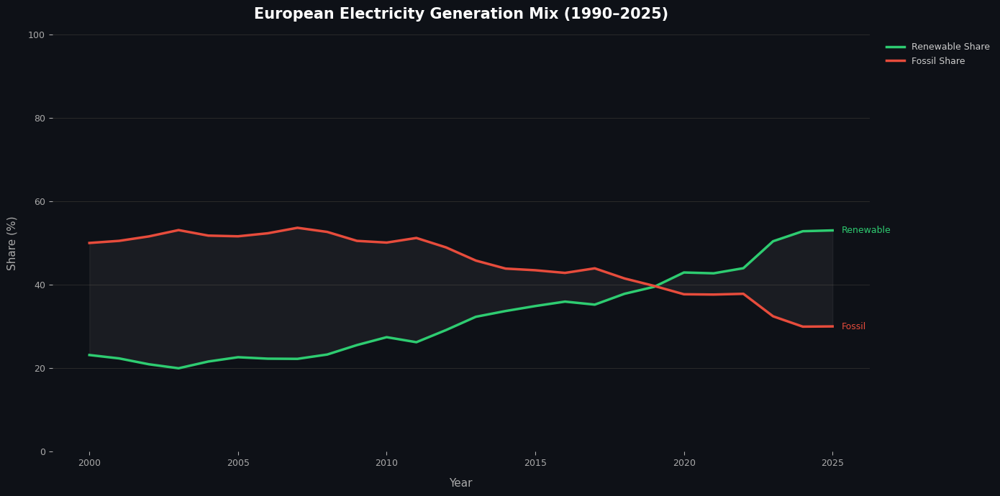
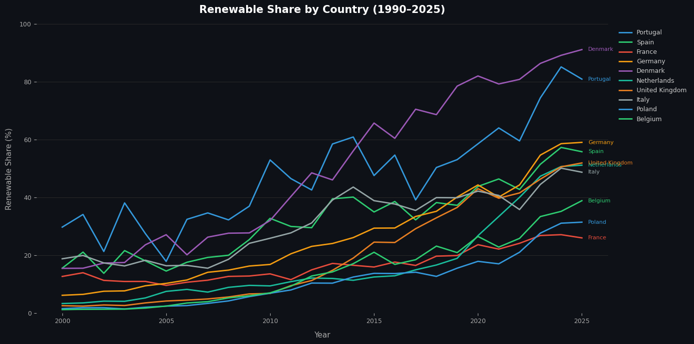
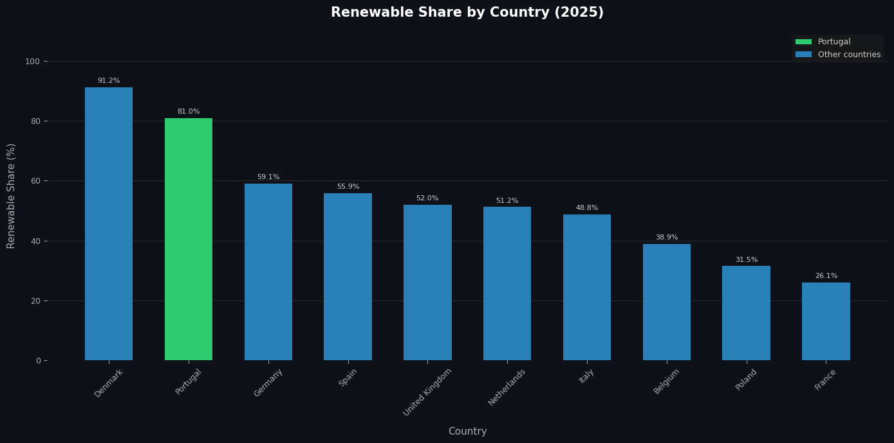
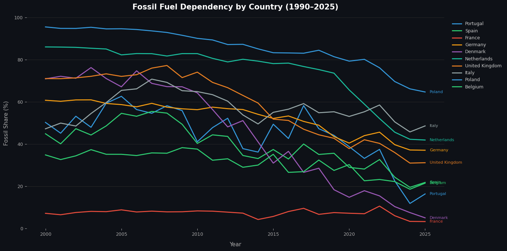
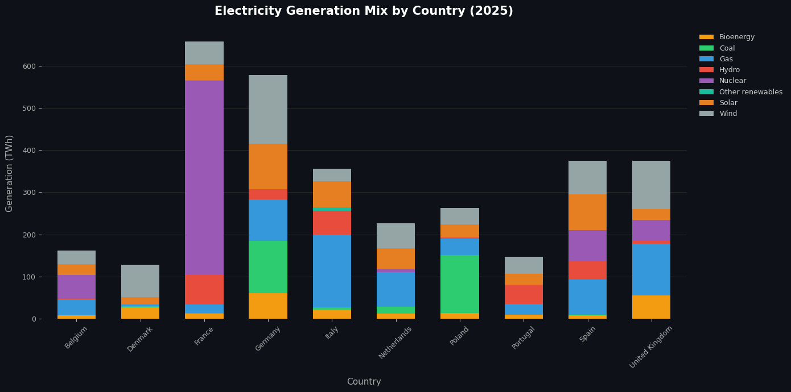
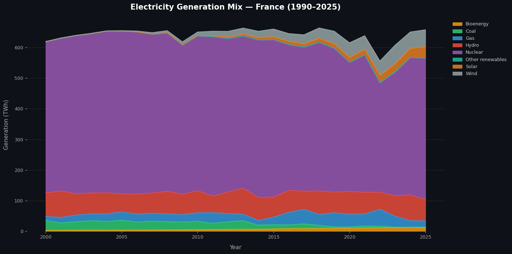
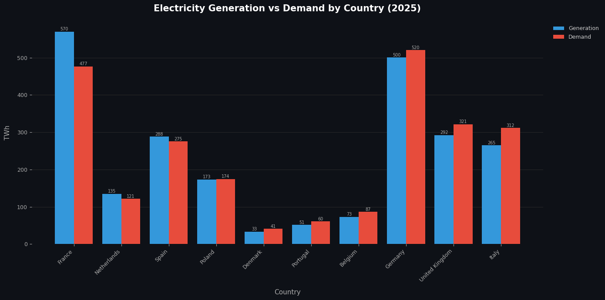
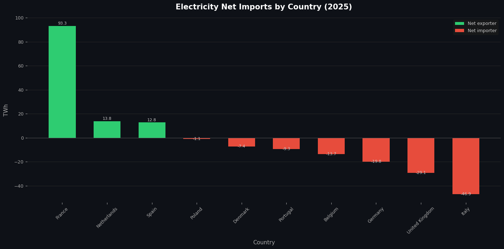
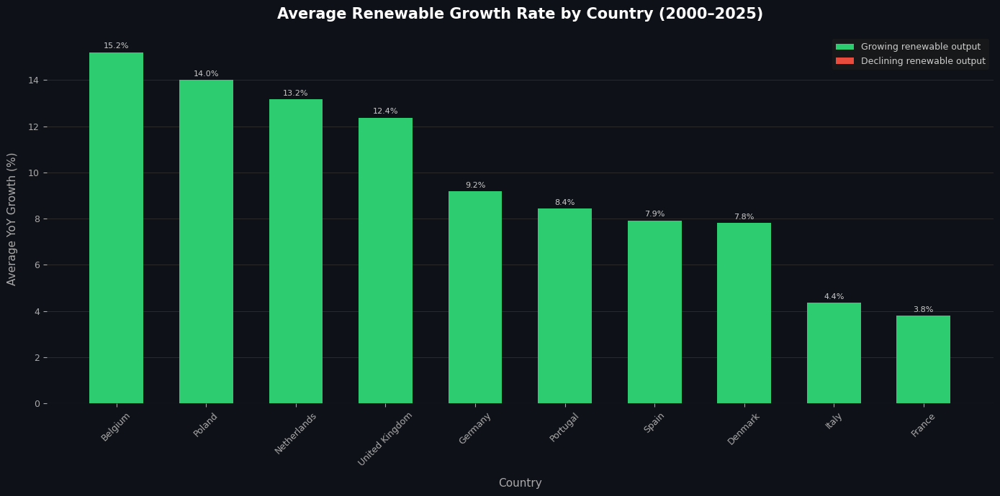

# 🔋 European Energy Transition — Decarbonization Trends & Grid Reliability
### `Python` · `Pandas` · `Matplotlib` · `Tableau` · `HTML & CSS` · `Data Analytics` · `EDA` · `Data Visualization`

> **End-to-end data analytics project** — from raw dataset to two interactive dashboards (Tableau and a custom HTML/CSS build) — analyzing 25 years of electricity generation across Europe to surface insights on renewable adoption, fossil fuel dependency, and energy independence.

---

## 👤 About This Project

**David Hernandez | Data Analyst**  
📍 Lisbon, Portugal · April 2026  
🌐 [Live HTML Dashboard — GitHub Pages](https://davherdel.github.io/europe-energy-transition/energy-dashboard.html)  
🔗 [Interactive Dashboard — Tableau Public](https://public.tableau.com/app/profile/david.hernandez6239/viz/EuropeanEnergyTransition/Dashboard1-Overview)

This project was built independently as part of a professional data analytics portfolio, applying the full analytics workflow: **data wrangling → exploratory analysis → visualization → storytelling**.

---

## 🎯 Business Problem

Europe's energy transition is accelerating — but **progress is uneven across countries**, making it difficult to assess how effectively each system is evolving.

This analysis answers four core questions:

| Dimension | Question |
|---|---|
| 🌱 **Renewable Adoption** | Which countries are scaling up, and how fast? |
| ⚠️ **Fossil Dependency** | Who remains exposed, and to what degree? |
| 🔌 **Energy Independence** | Are countries generating what they consume? |
| ⚖️ **System Balance** | What is the relationship between generation and demand? |

The goal: move beyond headline numbers and assess the **effectiveness** of the energy transition — identifying pathways, measuring real progress, and surfacing implications for energy security.

---

## 🛠️ Tech Stack

| Tool | Usage |
|---|---|
| **Python 3** | Core analysis language |
| **Pandas** | Data cleaning, transformation, feature engineering |
| **Matplotlib** | Exploratory and presentation-quality charts |
| **Tableau Public** | Interactive 3-dashboard data product |
| **HTML & CSS** | Custom-built web dashboard hosted on GitHub Pages |
| **Jupyter Notebook** | Documented, reproducible analysis workflow |

---

## 📊 Dataset

**Source:** [Ember Energy — Yearly Electricity Data](https://ember-energy.org/data/yearly-electricity-data/)

- 200+ geographies · Multi-source (EIA, Eurostat, BP, UN, national sources)
- Variables: generation by source, capacity, emissions, demand, imports
- Scope used: **Europe, 2000–2025**, electricity generation focus

**Key data decisions made during preprocessing:**
- Identified and resolved **hierarchical double-counting** in aggregated variables (e.g., "Renewables" containing "Wind" + "Solar" already counted separately)
- Fixed **corrupted total generation values** for small countries (Estonia, Cyprus) by recalculating from mutually exclusive Clean + Fossil aggregates
- Standardized column names and filtered to base-level energy sources only

---

## 🔍 What Was Built

### Section 1 — Data Cleaning & Feature Engineering
- Filtered dataset to Europe-only, 2000–2025, electricity generation category
- Removed aggregated variables to prevent double counting
- Engineered key metrics: `renewable_share`, `fossil_share`, `renewable_yoy_growth`
- Exported two clean datasets: **Europe macro** and **country-level detail**

The cleaned macro dataset reveals the headline story — Europe's generation mix transformation over 25 years:



### Section 2 — Country Analysis & Visualization
Analyzed 10 countries selected for strategic coverage:

> 🇵🇹 Portugal *(focal country)* · 🇩🇰 Denmark *(renewable leader)* · 🇫🇷 France *(nuclear pathway)* · 🇩🇪 Germany · 🇬🇧 UK · 🇮🇹 Italy · 🇳🇱 Netherlands · 🇵🇱 Poland *(fossil-heavy contrast)* · 🇪🇸 Spain · 🇧🇪 Belgium

**Renewable adoption — trajectory and current state:**





**Fossil fuel dependency:**



**Generation mix by country:**



**Case Study — France:** low-carbon through nuclear, not renewables



**Case Study — Portugal:** diversified renewable-driven transition

### Section 3 — Generation vs. Demand

**Are countries generating what they consume?**





**How fast is each country transitioning?**



---

## 💡 Key Findings

- 🔑 **Renewables surpassed fossil fuels in Europe around 2019** — a structural shift, not a temporary fluctuation
- 🇩🇰 Denmark leads in renewable share; **Portugal outperforms several larger European economies**
- 🇫🇷 France demonstrates an **alternative low-carbon pathway**: low fossil dependency driven by nuclear, not renewables
- 🇵🇱 Poland remains the most fossil-dependent system in the analysis group
- ⚡ **High renewable share ≠ energy independence** — import dependency is shaped by capacity, demand, and system design
- 🌍 The transition is **not a single pathway** — national strategies differ significantly by geography, infrastructure, and policy

---

## 📁 Repository Structure

```
├── energy_transition_decarbonization_trends_and_grid_reliability.ipynb  # Main analysis
├── energy-dashboard.html                     # Custom HTML/CSS dashboard (GitHub Pages)
├── europe_energy_transition_clean.csv        # Dataset A: Europe macro
├── country_energy_transition_clean.csv       # Dataset B: Country-level
├── europe_yearly_full_release_long_format.csv  # Source data (Ember Energy)
└── *.png                                     # Exported analysis charts
```

---

## 📈 Interactive Dashboards

The analysis culminates in **two interactive dashboards**:

### Tableau Public — 3-dashboard workbook

| Dashboard | Focus |
|---|---|
| **Dashboard 1 — Overview** | EU-level fossil vs renewable crossover · KPIs · Country trends |
| **Dashboard 2 — Country Analysis** | Generation mix · Renewable & fossil rankings by country |
| **Dashboard 3 — Deep Dive** | Case studies France & Portugal · Generation vs demand · Transition speed |

### Custom HTML/CSS Dashboard — built from scratch

A standalone web dashboard with KPI cards, time-period filters, and interactive charts — designed, coded, and deployed independently on GitHub Pages.

🌐 **[Live HTML Dashboard](https://davherdel.github.io/europe-energy-transition/energy-dashboard.html)**  
🔗 **[View on Tableau Public](https://public.tableau.com/app/profile/david.hernandez6239/viz/EuropeanEnergyTransition/Dashboard1-Overview)**

---

##  About Me

Data Analyst transitioning from 10 years in IT management and operations, bringing a strong foundation in process thinking, stakeholder communication, and systems — now applied to data analytics, machine learning, and business-aligned data architecture.
I build end-to-end analytical solutions — from data pipelines to dashboards — with a focus on translating data into value and decisions.

📬 [LinkedIn](https://www.linkedin.com/in/david-hernandez-cr-pt/) · [GitHub](https://github.com/davherdel) · [Tableau Public](https://public.tableau.com/app/profile/david.hernandez6239)